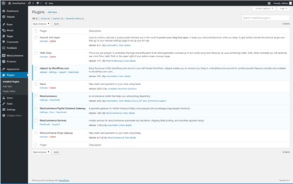

# Nexio WooCommerce Plugin Instructions

## Installation:

1. Unzip the ‘cms-gateway-nexio.zip’ file.
2. Copy the ‘cms-gateway-nexio’ directory into your WordPress plugin directory: ‘wp-content/plugins’.
3. Log in to your WordPress Administration page.
4. Activate the plugin:
    a. On the left-hand menu, click on ‘Plugins’ then ‘Installed Plugins’.
    b. Find the ‘Nexio’ plugin.
    c. Click the ‘Activate’ link to activate the plugin.
Example:

5. Enable the payment method and set parameters:
    a. On the left-hand menu, click on ‘WooCommerce’.
    b. Under ‘WooCommerce’ click on ‘Settings’.
    c. Open the ‘Payments’ menu.
    d. Scroll down to the ‘Nexio’ method and activate it by clicking the toggle button.
    e. Scroll to the bottom and click ‘Save changes’.
Example:

6. Next, open the ‘Payments’ menu.
7. Select the ‘Enable Nexio’ check box.
8. Type in the following fields:
    - **Title**: Credit Card (Nexio)
    - **Description**: Your choice (See below for an example.)
    - **API URL**:
        - For testing: https://api.nexiopaysandbox.com/
        - For production: https://api.nexiopay.com/
    - **User Name**: Your Nexio username
    - **Password**: Your Nexio password
    (If you have questions or if you need a Nexio username and password, please contact integrations@nexiopay.com)
    - **CSS**: Your online CSS file URL for Nexio form.
    - **Fraud Check**: Enable fraud check in transaction. Please ensure Kount is enabled for your merchant account by contacting CMS customer support.
    - **Require CVC**: Require CVC in Nexio form.
    - **Hide CVC**: Hide CVC info.
    - **Hide Billing**: Hide billing info.
9. Scroll to the bottom of the page and click ‘Save changes’.
Example:

## Using the Plugin:
1. Create a product:
    a. Log in to your WordPress Administration page.
    b. On the left-hand menu, click on ‘Products’ then ‘Add New’.
    c. Type in your product details.
    d. Click ‘Publish’.
Example:

2. Add the product to cart:
    a. Go to your WooCommerce shop or product page and the add product to your cart.

3. Check out and choose Nexio as payment method:
    a. Once on the Cart page, click on the ‘Proceed to checkout’ button.
    Example:

    b. Fill your billing details information.
    c. Choose ‘Credit Card (Nexio)’ as your payment method
    d. Click the ‘Continue to payment’ button to proceed to the final order page.
    Example:
    
4. Fill in card information and submit the transaction:
    a. Once the ‘Pay for order’ page has loaded you will see a Nexio payment form. (See screenshot below)
    b. Enter in the required fields.
    c. Click the ‘Pay via Nexio’ button to submit the transaction.
    d. If the transaction succeeds, you will see an ‘order received’ page, otherwise, it will return to checkout page for retry.
    Example:
